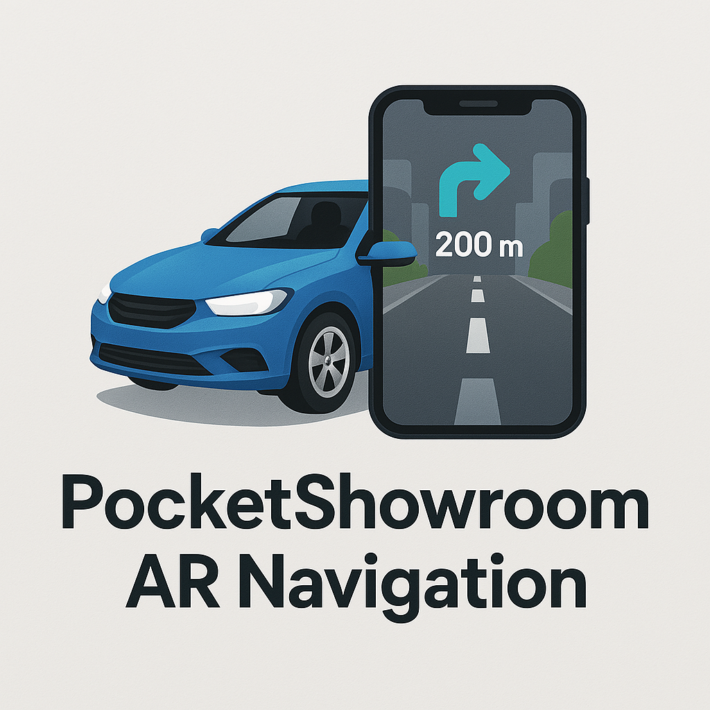

# 🚗 PocketShowroom AR-Navigation

<div align="center">
  

### 🏆 National Top 40, Grand Finalist – XR Creator Hackathon @ WAVES Summit 2025 🇮🇳  
_Initiative Backed by Ministry of Information and Broadcasting, India_


</div>

---

## 🔍 Overview

**PocketShowroom AR Navigation** brings the car showroom experience into your pocket — and overlays real-time directions on the road using AR.

Built with Unity and Vuforia, this project features:

### 🚗 Markerless AR Car Showroom
- Place cars in your environment
- Change car color
- Interact with doors and interior

### 🧭 AR GPS Navigation
- Live dashboard with directions (turn-by-turn)
- Area info displayed in AR
- Works with your phone mounted inside your car

---

## 🛠️ Technologies Used

| Tool           | Purpose                        |
|----------------|--------------------------------|
| 🧰 Unity        | Core development environment   |
| 🪞 Vuforia      | Markerless AR implementation   |
| 📱 Android/iOS | Target platforms               |

---

## 🖼️ Screenshots

| Feature              | Preview |
|----------------------|---------|
| AR Car Placement     |  |
| Color Customization  |  |
| Interior Interaction |  |
| AR GPS Navigation    |  |
| Dashboard Insights   |  |
| Real World Overlay   |  |

---

## ⚙️ Installation & Setup

```bash
git clone https://github.com/jishanahmed-shaikh/XR-Creator-Submission.git
```

1. Open the project in **Unity 2021.3.4f1**
2. Install and configure the **Vuforia SDK**
3. Build and deploy the project to your mobile device

> 🔧 _Note: We've customized Vuforia objects to integrate with the AR location library — please use the specified Unity version for compatibility._

---

## 🚀 How to Use

### 🎮 Markerless AR CAR
1. Launch the app and open the **"Pocket Showroom"** section
2. Select your car model and place it via camera
3. Customize its color and explore interactive features

### 📍 AR GPS Navigation
1. Head to the **"AR GPS Navigation"** section
2. Mount your phone securely inside your vehicle
3. Begin navigation and enjoy real-time AR guidance

---

## 🤝 Acknowledgements

This project is a result of collaboration with:  
[🔗Rahil-Shaikh](https://github.com/Mihaillo29)

---

<div align="center">

### 💡 Have Feedback or Ideas?

We're always open to creativity and innovation.  
Feel free to:
 
 ⭐ Star the repository if you find it inspiring  
 🛠️ Submit a pull request to contribute  
 💬 Open an issue to share suggestions or bugs  

---

### 🚧 Future Roadmap

We plan to expand and elevate the experience with:
 
 🌐 Multi-location car exploration  
 🧠 AI-enhanced navigation insights  
 📊 Real-time vehicle diagnostics overlay  
 🎥 AR recording and social sharing features

---

### 🚀 Built to Innovate. Designed for Immersion. Powered by Collaboration.

</div>
